# UE5DroneControl — 系统时序图

> 版本：v0.3 | 生成日期：2026-06-05
> 覆盖范围：系统初始化、注册、遥测、控制、集结、预演、整体数据流

---

## 1. 系统初始化

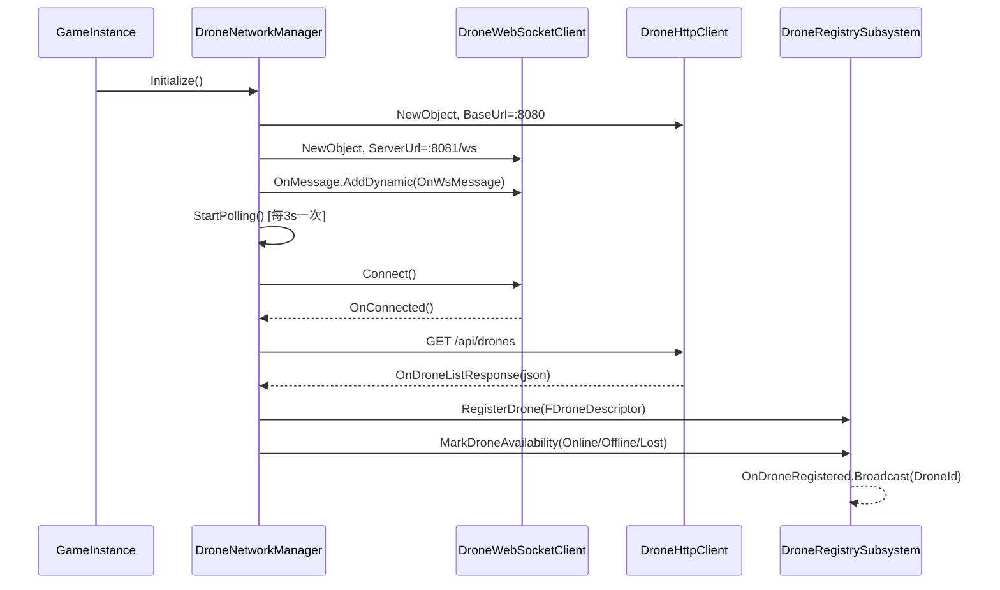

---

## 2. 主菜单无人机注册

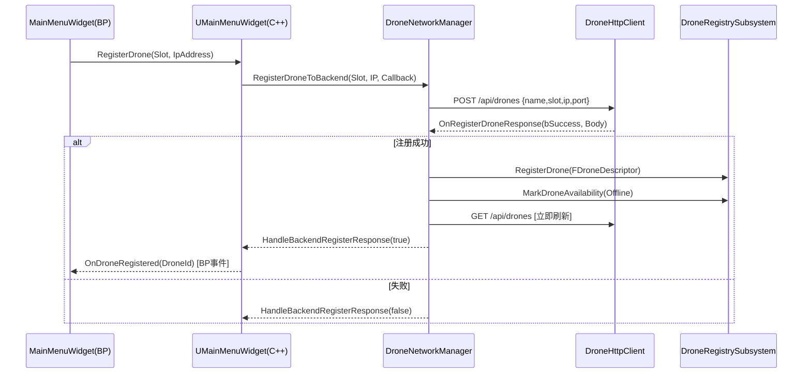

---

## 3. 遥测下行（WebSocket → UE5 Actor）

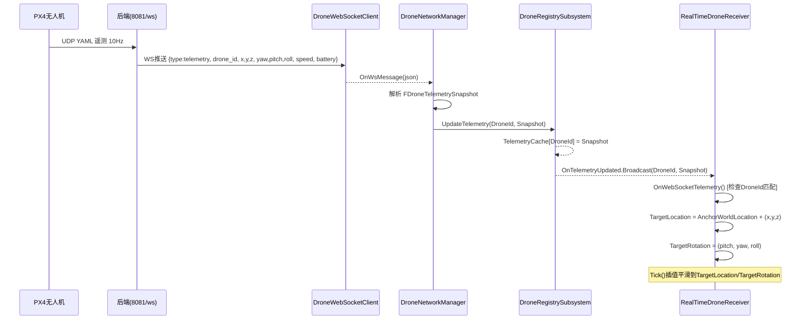

---

## 4. power_on 事件 & GPS 锚点建立

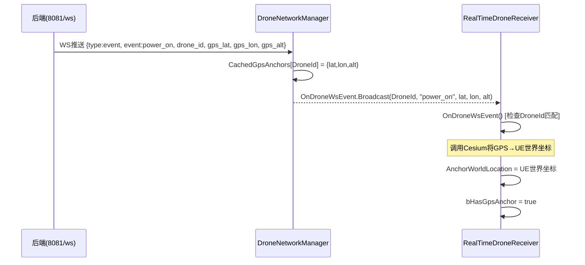

---

## 5. 控制指令上行（鼠标点击 → 移动）

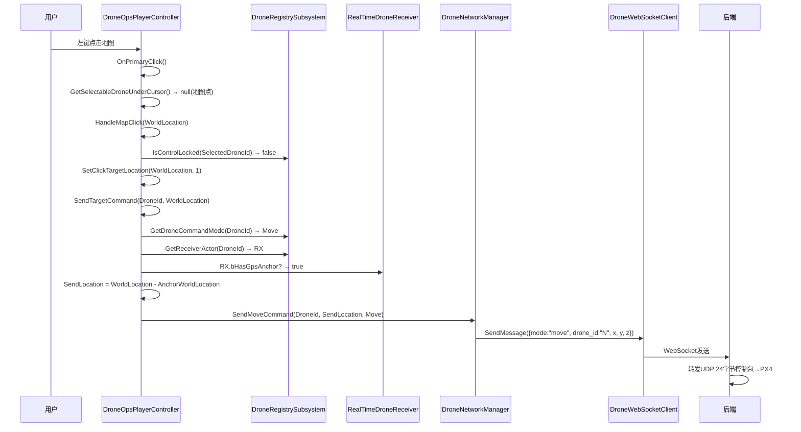

---

## 6. 多机选择与派发

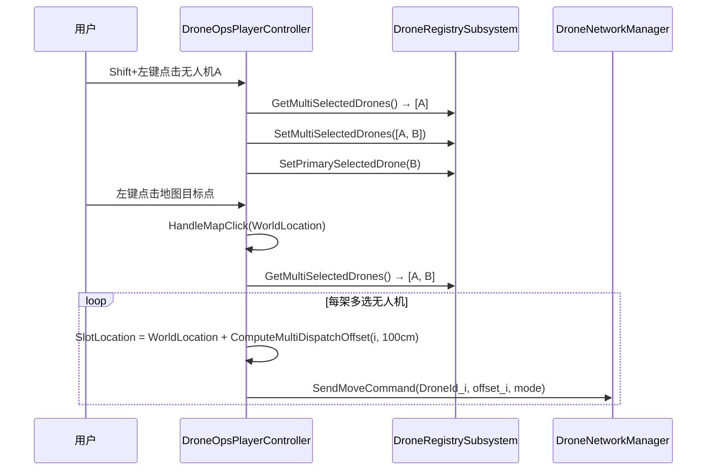

---

## 7. 阵列任务 & 集结流程

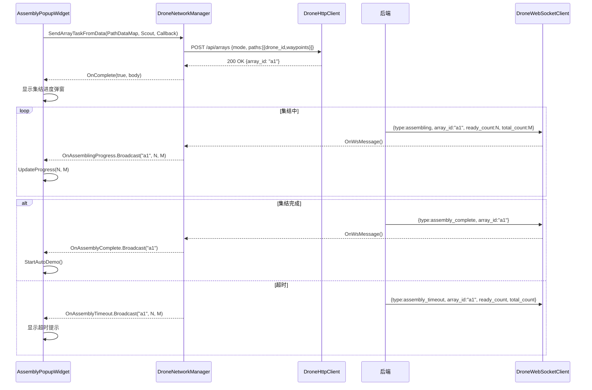

---

## 8. 暂停 / 恢复

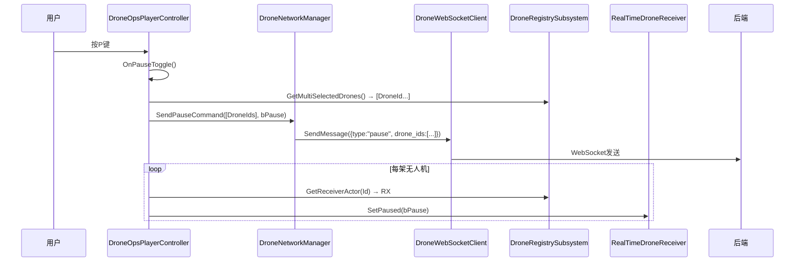

---

## 9. 关卡加载 & Drone Spawn（GameMode 启动流程）

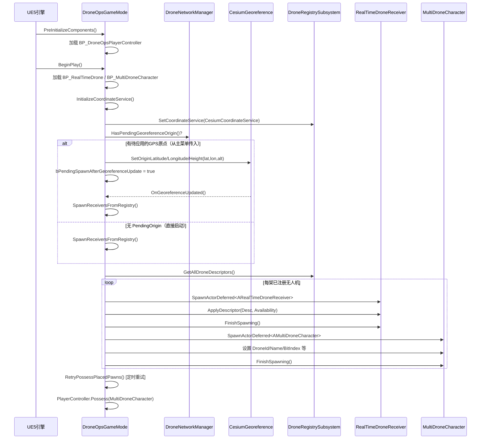

---

## 10. 主菜单跳转预演关卡（含 Cesium 原点传递）

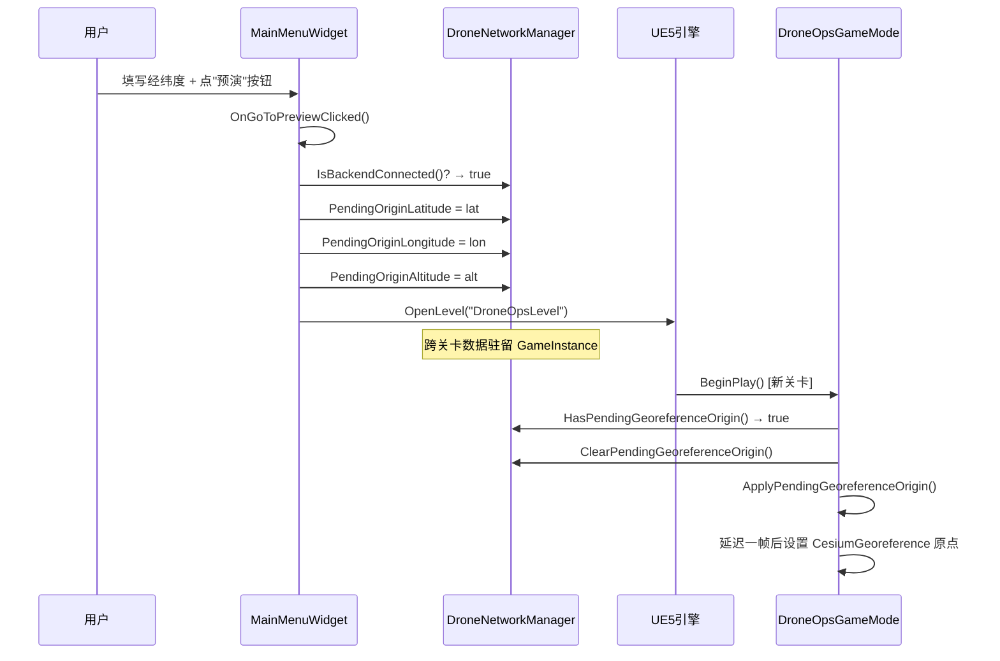

---

## 11. 本地预演回放（DronePlaybackManager）

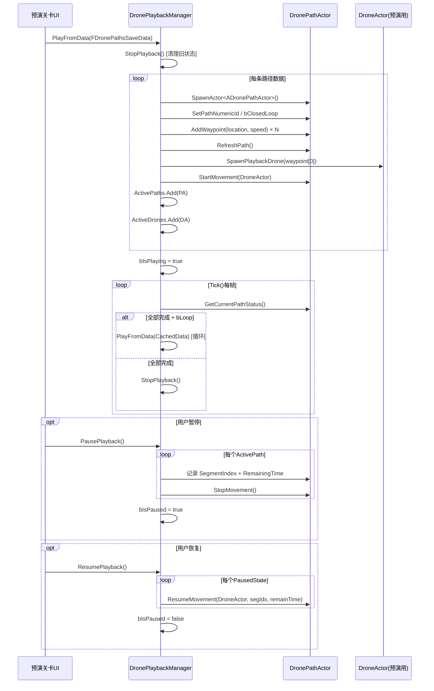

---

## 12. 整体数据流总览

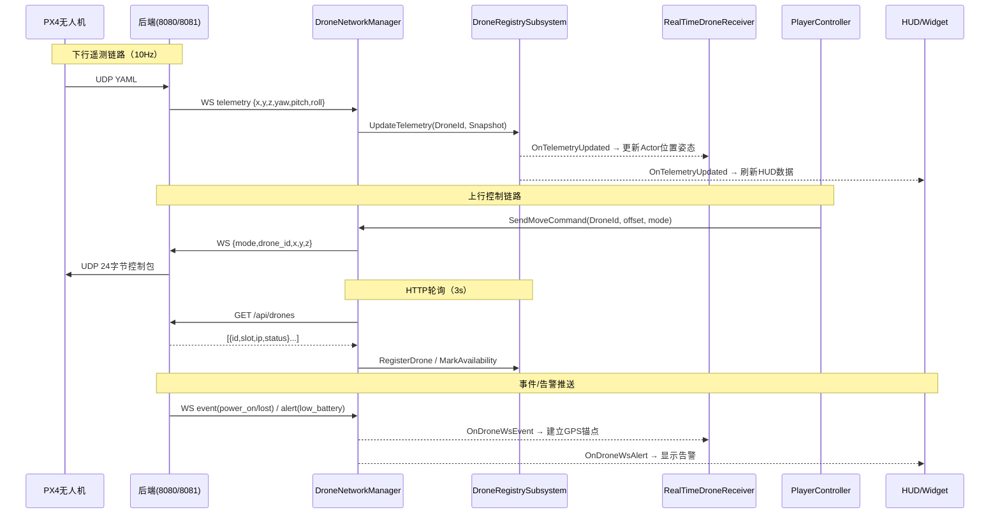
